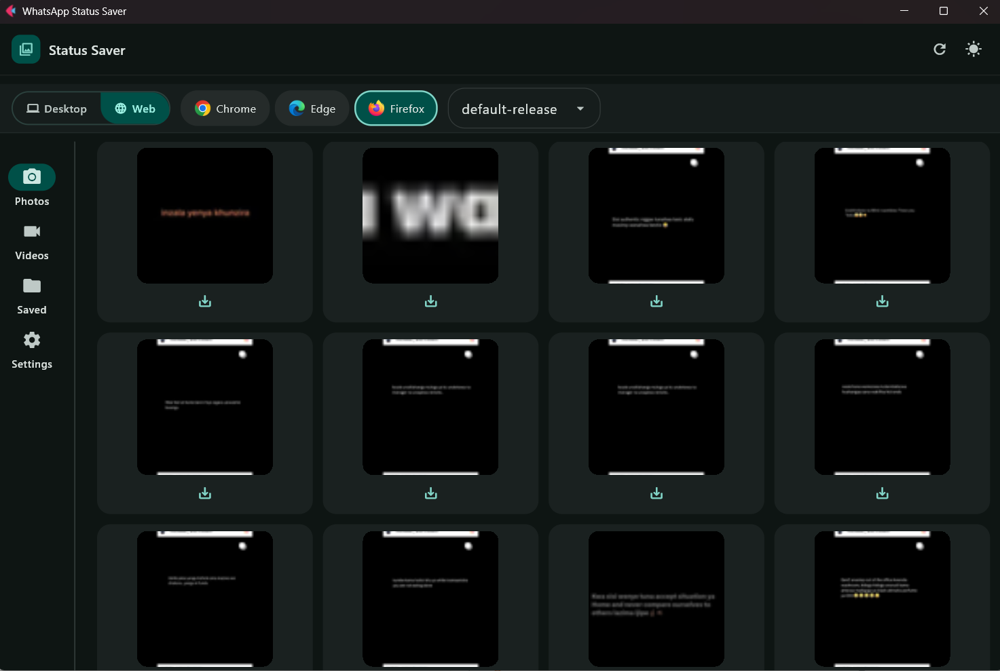

# WhatsApp Status Saver



Download WhatsApp statuses on Windows from WhatsApp Desktop or WhatsApp Web.

It works from WhatsApp data already stored locally on your machine and supports:

- WhatsApp Desktop
- Chrome
- Edge
- Firefox

## Features

- WhatsApp Desktop support on Windows
- WhatsApp Web support from local browser profiles
- Chrome, Edge, and Firefox support
- Photos, videos, and text statuses
- Copy text and link statuses directly from the app
- Save text statuses as rendered images
- Manual refresh for newly discovered statuses
- Optional automatic background updates
- Open media in the default system app
- Theme support
- Friendly browser profile names when available

This project does not use an official WhatsApp API.

## Download for Windows

Latest Windows build:

- [Download WhatsApp Status Saver for Windows](https://github.com/alvinmurimi/whatsapp-desktop-status-saver/releases/latest/download/WhatsAppStatusSaver-windows-x64.zip)

Extract the zip and run `WhatsAppStatusSaver.exe`.

Python is not required for the bundled build.

## Run From Source

### Requirements

- Windows 10 or Windows 11
- Python 3.14
- WhatsApp Desktop, or Chrome / Edge / Firefox with WhatsApp Web logged in

### Setup

```powershell
git clone https://github.com/alvinmurimi/whatsapp-desktop-status-saver.git
cd whatsapp-desktop-status-saver
py -3.14 -m venv venv
.\venv\Scripts\Activate.ps1
pip install -r requirements.txt
python main.py
```

## Supported Sources

### WhatsApp Desktop

For current WhatsApp Desktop builds on Windows, the app reads WhatsApp Desktop's local WebView storage and reconstructs status records from it.

Where available, it can also fall back to the older cache-based discovery path used by earlier WhatsApp Desktop builds.

### WhatsApp Web

For WhatsApp Web, the app reads local browser profile data from the selected supported browser:

- Chrome
- Edge
- Firefox

## Technical Stack

- Python 3.14
- Flet for the desktop UI
- Pillow for image handling and text-status rendering
- OpenCV for video thumbnail generation
- `cryptography` for WhatsApp media decryption when needed
- `ccl_chromium_reader` for Chromium/WebView IndexedDB parsing on Windows
- Firefox local storage parsing for WhatsApp Web profile support
- Local JSON, media, and thumbnail caching for repeated loads
- Live local-session text hydration for statuses whose body text is not fully exposed at rest

## Security and Privacy

This app runs locally and reads WhatsApp-related local storage on your device in order to discover statuses.

It is not designed to export or transmit your WhatsApp login session, and it does not intentionally target browser cookies or session takeover data.

Because it accesses local app and browser profile data, you should only run builds you trust and only download releases from this repository.

## Limitations

This project depends on WhatsApp's private local storage behavior, which can change at any time.

Known constraints:

- a future WhatsApp update may break status discovery
- some status records may exist after their media URLs expire
- some text statuses may require live-session hydration before they can be shown correctly
- support is currently focused on Windows

## Build Windows Bundle

To build the Windows bundle locally:

```powershell
.\venv\Scripts\Activate.ps1
.\build_windows_release.ps1 -PythonExe .\venv\Scripts\python.exe -Version 1.0.3
```

Output:

- `output\release\WhatsAppStatusSaver`
- `output\release\WhatsAppStatusSaver-windows-x64.zip`

Upload `output\release\WhatsAppStatusSaver-windows-x64.zip` to a GitHub Release to distribute it.

## Contributing

Issues, bug reports, and pull requests are welcome at the [issues page](https://github.com/alvinmurimi/whatsapp-desktop-status-saver/issues).

## License

This project is licensed under the MIT License. See the [LICENSE](LICENSE) file for details.
