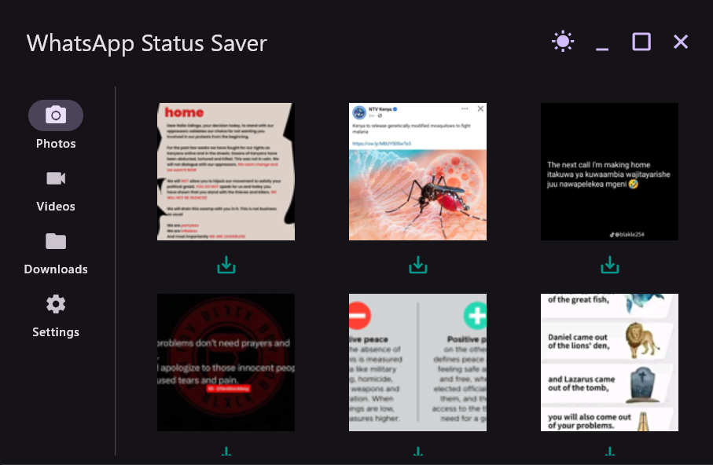

# WhatsApp Desktop Status Saver

WhatsApp Status Saver is a cross-platform desktop application designed to seamlessly download and manage statuses for WhatsApp desktop.



## Background

As an avid WhatsApp user, I couldn't find an easy way to save statuses without emulators or complex workarounds, so I developed this simple, user-friendly app to do the job.

## Key Features

- **Cross-platform Support**: Works on both Windows and macOS
- **Intuitive UI**: Clean, responsive interface for easy navigation
- **Media Categorization**: Separate sections for photos and videos
- **Thumbnail Previews**: Quick visual browsing of available statuses
- **One-Click Save**: Effortlessly download statuses to your chosen directory
- **Theme Options**: Toggle between light and dark modes for comfortable viewing
- **Efficient File Management**: Delete saved statuses directly from the app
## Technical Stack

### Core Technologies

- **Python 3.7+**: Foundation of the application for its versatility and rich ecosystem.
- **Flet**: Framework for building interactive multi-platform applications using Flutter, enabling a responsive UI with Python.
- **asyncio**: Handles asynchronous operations for smooth performance during file operations and UI updates.

### Key Libraries

- **Pillow (PIL Fork)**: Image processing for creating and manipulating thumbnails.
- **OpenCV (cv2)**: Video processing to extract thumbnail frames from video statuses.

## How It Works

1. **Status Discovery**: Scans the WhatsApp desktop client's local storage directory where statuses are temporarily cached.
2. **File Categorization**: Sorts statuses into photos and videos based on file extensions.
3. **Thumbnail Generation**: Uses Pillow for images and OpenCV for videos to create thumbnails.
4. **UI Rendering**: Flet is used to create the user interface.
5. **Asynchronous Operations**: Handles file downloads and deletions asynchronously to prevent UI freezing.
6. **Local Storage**: Saves downloaded statuses to a user-specified directory; default set to a 'WhatsappStatuses' folder in the user's Downloads directory.

## Installation

1. Clone this repository:
   
   ```git clone https://github.com/alvinmurimi/whatsapp-desktop-status-saver.git```

3. Install the required dependencies:
   
   ```pip install -r requirements.txt```

5. Run the application:
   
   ```python main.py``` or  ```flet run main.py```
## Requirements

- Python 3.7+
- Flet (0.23.2)
- Pillow (10.4.0)
- OpenCV Python (4.10.0.84)

  
For a complete list of dependencies, refer to the `requirements.txt` file.

## Compatibility

   - **Windows**: Compatible with Windows 10 and 11
   - **macOS**: Compatible with macOS 10.15 (Catalina) and later

Note: The WhatsApp desktop app must be installed and logged in on your computer for this application to work.

## Contributing
Contributions, issues, bug reports and feature requests are welcome! Feel free to check the [issues page](https://github.com/alvinmurimi/whatsapp-desktop-status-saver/issues).

## License

This project is licensed under the MIT License. See the [LICENSE](LICENSE) file for details.

## Disclaimer

This application is intended for personal use only. Users are responsible for respecting the privacy and copyright of content creators when saving and using WhatsApp statuses.
